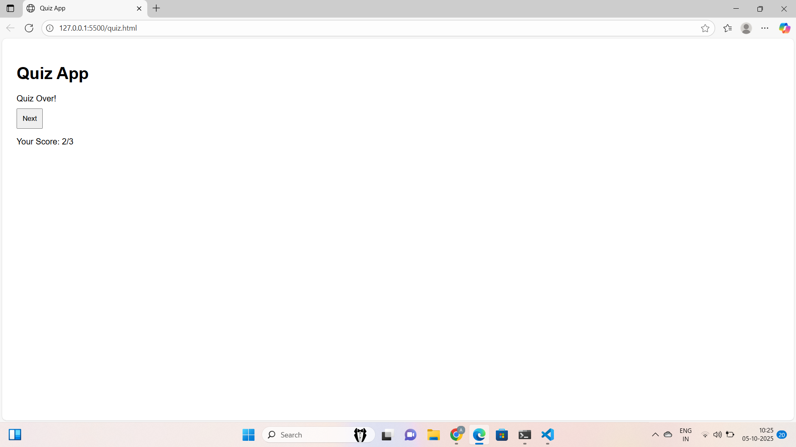
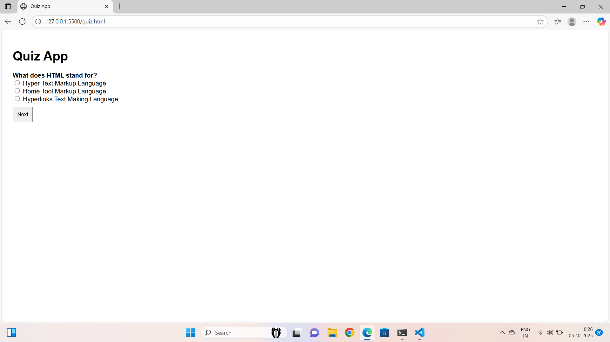
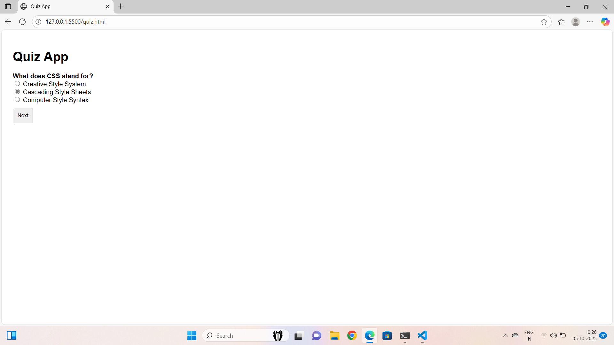
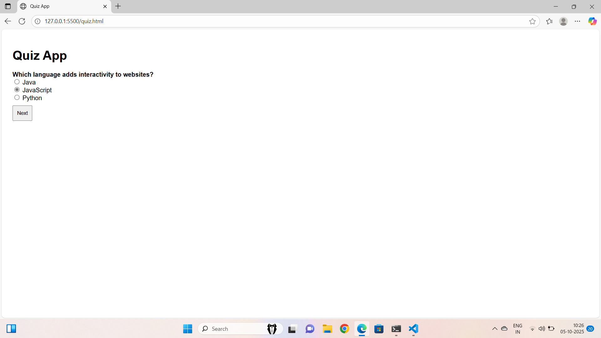

🌟 QuizApp
📋 Description
A simple and responsive Quiz App built using HTML, CSS, and JavaScript.
This project demonstrates basic front-end skills like DOM manipulation, styling, and event handling.

🚀 Live Demo
https://ankithakanneboina.github.io/QuizApp/

🔗 View Project Here

(Upload your project to GitHub Pages and put the link here.)

🧰 Technologies Used

HTML5 — For structure

CSS3 — For styling and layout

JavaScript (ES6) — For interactivity

🎯 Features

✅ [List feature 1 — e.g.you can click options]
✅ [List feature 2 — e.g. Responsive layout for all screen sizes]
✅ [List feature 3 — e.g. Interactive buttons with animations]

📸 Screenshots
| Home Section | About Section |
|---------------|---------------|
|  |  |
|  |  |
|  |  |

Home Page	Functionality
	
💡 How to Use

Clone this repository

git clone https://github.com/ankithakanneboina/QuizApp.git

Open index.html in your browser

Enjoy using the app 🎉

🧠 What I Learned

While building this project, I learned:

How to manipulate the DOM using JavaScript

Basics of responsive design using CSS

Writing cleaner and modular front-end code

🌈 Future Improvements

🔹 Add more features like [e.g. local storage / API integration]
🔹 Improve UI with animations or transitions
🔹 Make it mobile-friendly
👨‍💻 Author
Ankitha Kanneboina
📧 ankithakanneboina350@gmail.com
🔗 • [GitHub](https://github.com/ankithakannebina)
🔗  • [GitHub]
